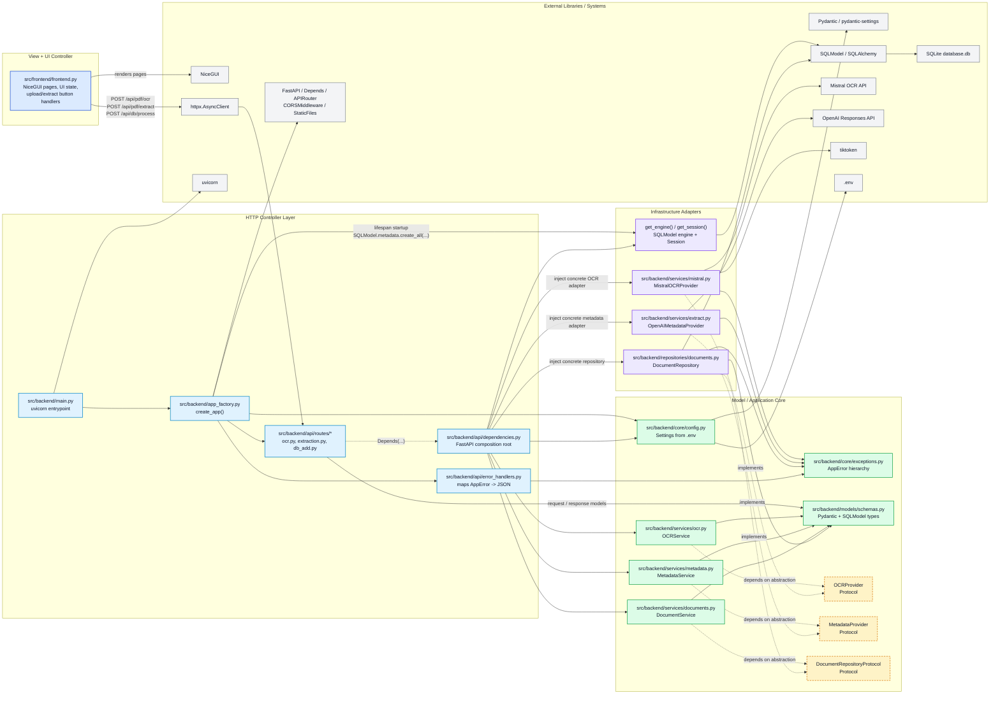

# Baker Project Architecture Diagram

This diagram reflects the current codebase and the terminology used in the design document.

- Solid arrows show runtime calls, composition, or library usage.
- Dashed arrows show dependency inversion: high-level services depend on abstractions, while concrete adapters implement those abstractions.
- `frontend.py` currently combines the user-facing view and UI controller responsibilities.

## Dependency Inversion Focus

The key inversion points in the current implementation are:

1. `OCRService` depends on the `OCRProvider` protocol, while `MistralOCRProvider` is injected by `get_ocr_service()`.
2. `MetadataService` depends on the `MetadataProvider` protocol, while `OpenAIMetadataProvider` is injected by `get_metadata_service()`.
3. `DocumentService` depends on `DocumentRepositoryProtocol`, while `DocumentRepository` is injected by `get_document_service()`.

That makes `src/backend/api/dependencies.py` the composition root for the application: the high-level services stay stable, and the low-level providers or persistence adapters can be replaced without rewriting the service layer or route handlers.
